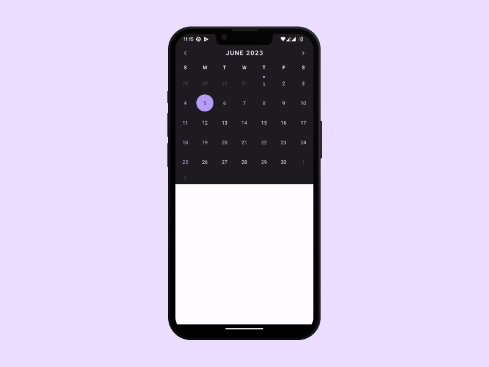
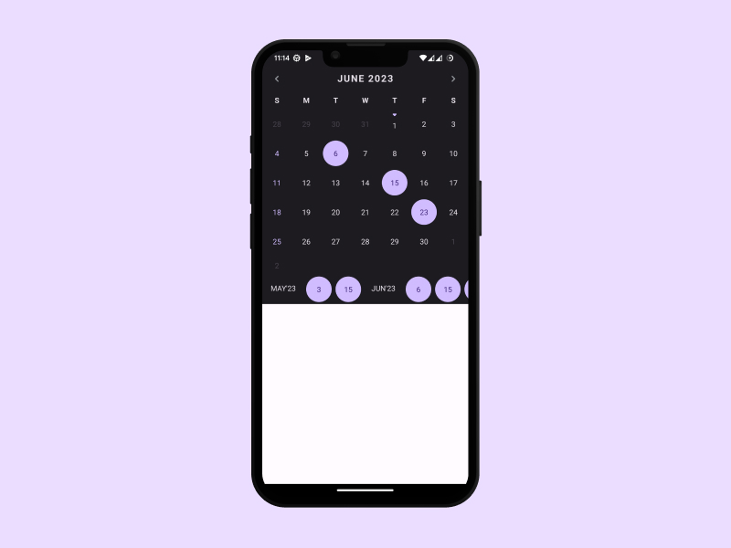
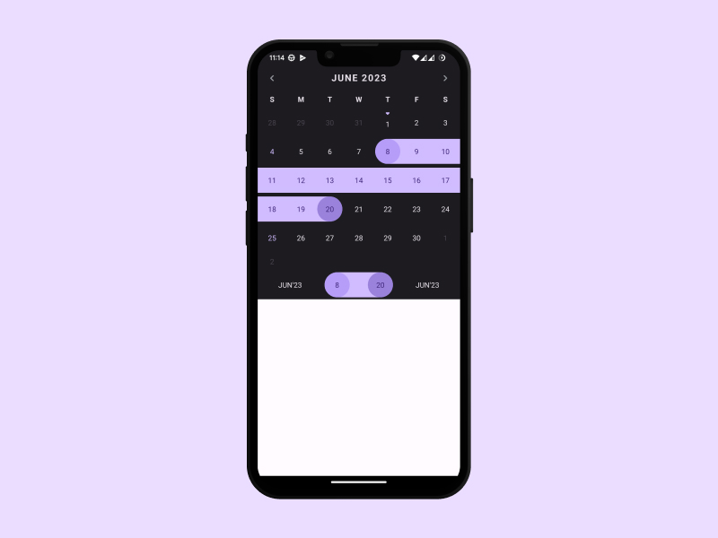
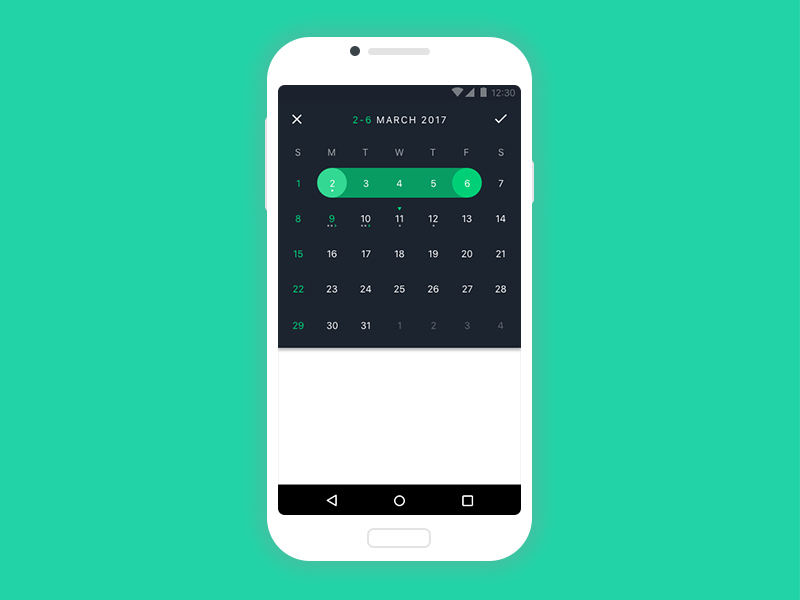

# Simple Calendar

[
](https://opensource.org/license/mit/)
</a>


This is a slightly modified and updated fork for recent versions of OracleJDK and Android SDK of CosmoCalendar library, the original library and more details can be found at https://github.com/ApplikeySolutions/CosmoCalendar by [Applikey Solutions](https://applikeysolutions.com)


## Authors

- CosmoCalendar (original library) [by Applikey Solutions](https://applikeysolutions.com/)
- This fork by [@LuisGamas](https://github.com/LuisGamas)

##

* [Usage](#usage)
* [Customization](#customization)
  * [Common](#common)
  * [Selection](#selection)
  * [Current day](#current-day)
  * [Navigation buttons](#navigation-buttons)
  * [Weekend days](#weekend-days)
  * [Connected days](#connected-days)
  * [Disabled days](#disabled-days)
  * [Month change listener](#month-change-listener)
  * [Calendar dialog](#calendar-dialog)
* [Demo](#demo)
* [Release Notes](#release-notes)
* [Contact Us](#contact-us)
* [License](#license)


# Usage

* Java
  ```xml
        implementation 'io.github.luisgamas:simplecalendar:{version}'
  ```

* Version

[](https://central.sonatype.com/artifact/io.github.luisgamas/simplecalendar)


# Customization

### Common
* calendarOrientation - Possible values: HORIZONTAL, VERTICAL
* calendarBackgroundColor
* monthTextColor
* otherDayTextColor
* dayTextColor
* firstDayOfTheWeek
* weekDayTitleTextColo
* showDaysOfWeek - Defines if we need to display week day titles for every month
* showDaysOfWeekTitle - Defines if we need to display week day title for whole calendar

### Selection
* selectionType - Possible values: SINGLE, MULTIPLE, RANGE, NONE
* selectedDayTextColor
* selectedDayBackgroundColor
* selectedDayBackgroundStartColor - Background color of START day from selected range
* selectedDayBackgroundEndColor - Background color of END day from selected range
* selectionBarMonthTextColor

### Current day
* currentDayTextColor
* currentDayIconRes
* currentDaySelectedIconRes

### Navigation buttons
* previousMonthIconRes
* nextMonthIconRes

### Weekend days
* weekendDays
  ```java
  calendarView.setWeekendDays(new HashSet(){{
            add(Calendar.THURSDAY);
            add(Calendar.TUESDAY);
  }});
  ```

* weekendDayTextColor

### Connected days
You can add some days for example holidays:
  ```java
  //Set days you want to connect
  Calendar calendar = Calendar.getInstance();
  Set<Long> days = new TreeSet<>();
  days.add(calendar.getTimeInMillis());
  ...
  
  //Define colors
  int textColor = Color.parseColor("#ff0000");
  int selectedTextColor = Color.parseColor("#ff4000");
  int disabledTextColor = Color.parseColor("#ff8000");
  ConnectedDays connectedDays = new ConnectedDays(days, textColor, selectedTextColor, disabledTextColor);

  //Connect days to calendar
  calendarView.addConnectedDays(connectedDays);
  ```
and customize them:
* connectedDayIconRes;
* connectedDaySelectedIconRes;
* connectedDayIconPosition (TOP/BOTTOM);
  ```java
  calendarView.setConnectedDayIconPosition(ConnectedDayIconPosition.TOP);
  ```

### Disabled days
You can add days so that you can not select them:
  ```java
  Set<Long> disabledDaysSet = new HashSet<>();
  disabledDaysSet.add(System.currentTimeMillis());
  calendarView.setDisabledDays(disabledDaysSet);
  ```
#### Disabled days criteria
- month criteria range:
  ```java
  //from 1st to 5th day of the month
  calendarView.setDisabledDaysCriteria(new DisabledDaysCriteria(1, 5, DisabledDaysCriteriaType.DAYS_OF_MONTH)); 
  ```
- week criteria range:
  ```java
  //from Monday to Friday
  DisabledDaysCriteria criteria = new DisabledDaysCriteria(Calendar.MONDAY, Calendar.FRIDAY, DisabledDaysCriteriaType.DAYS_OF_WEEK);
  calendarView.setDisabledDaysCriteria(criteria);
  ```

* disabledDayTextColor - Text color of disabled day

### Month change listener
  ```java
  calendarView.setOnMonthChangeListener(new OnMonthChangeListener() {
            @Override
            public void onMonthChanged(Month month) {
                
            }
        });
  ```

### Calendar dialog
   ```java
   new CalendarDialog(this, new OnDaysSelectionListener() {
@Override
public void onDaysSelected(List<Day> selectedDays) {

        }
        }).show();
   ```
# Demo
Single Choice             |  Multiple
:-------------------------:|:-------------------------:
  |  
Range             |  Customized
  |  

# Contact the original creator

You can always contact us via github@applikeysolutions.com We are open for any inquiries regarding our libraries and controls, new open-source projects and other ways of contributing to the community. If you have used our component in your project we would be extremely happy if you write us your feedback and let us know about it!

# License

	MIT License

	Copyright (c) 2023 Luis Donaldo Gamas

	Permission is hereby granted, free of charge, to any person obtaining a copy
	of this software and associated documentation files (the "Software"), to deal
	in the Software without restriction, including without limitation the rights
	to use, copy, modify, merge, publish, distribute, sublicense, and/or sell
	copies of the Software, and to permit persons to whom the Software is
	furnished to do so, subject to the following conditions:

	The above copyright notice and this permission notice shall be included in all
	copies or substantial portions of the Software.

	THE SOFTWARE IS PROVIDED "AS IS", WITHOUT WARRANTY OF ANY KIND, EXPRESS OR
	IMPLIED, INCLUDING BUT NOT LIMITED TO THE WARRANTIES OF MERCHANTABILITY,
	FITNESS FOR A PARTICULAR PURPOSE AND NONINFRINGEMENT. IN NO EVENT SHALL THE
	AUTHORS OR COPYRIGHT HOLDERS BE LIABLE FOR ANY CLAIM, DAMAGES OR OTHER
	LIABILITY, WHETHER IN AN ACTION OF CONTRACT, TORT OR OTHERWISE, ARISING FROM,
	OUT OF OR IN CONNECTION WITH THE SOFTWARE OR THE USE OR OTHER DEALINGS IN THE
	SOFTWARE.
