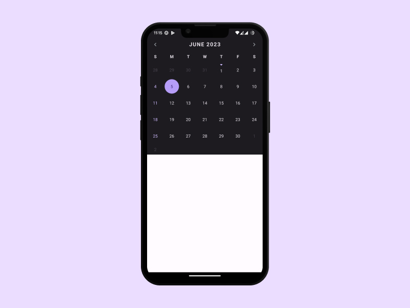
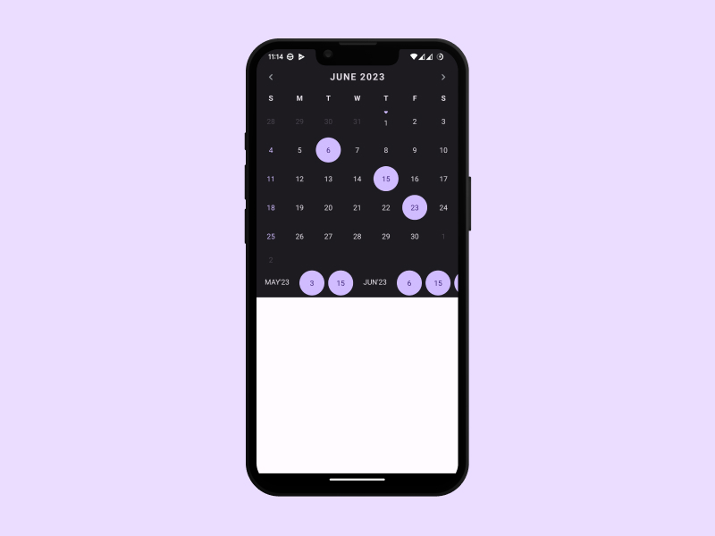
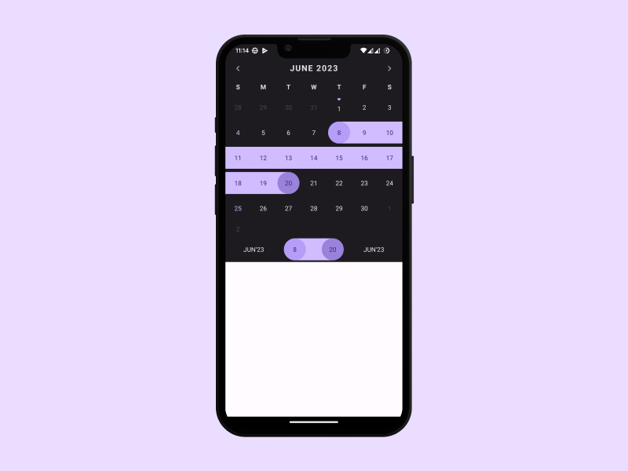
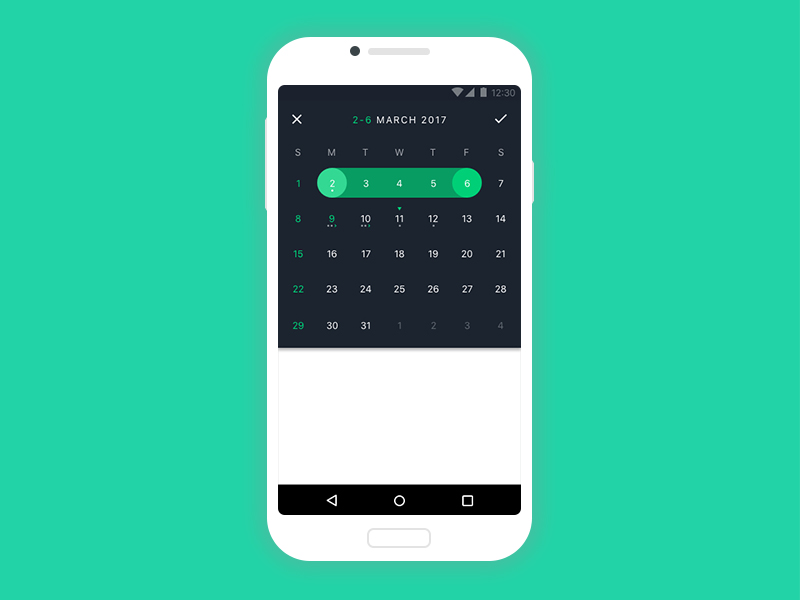

<div align="center">

# SimpleCalendar

[](https://opensource.org/license/mit/)

[](https://central.sonatype.com/artifact/io.github.luisgamas/simplecalendar)

A highly customizable Android calendar widget supporting **single**, **multiple**, and **range** selection with infinite scrolling, connected days, disabled days criteria, and full Material 3 colour theming.

</div>

> This project is a maintained fork of [CosmoCalendar](https://github.com/ApplikeySolutions/CosmoCalendar) by [Applikey Solutions](https://applikeysolutions.com/), updated for modern OracleJDK and Android SDK versions.

---

## Table of Contents

- [Features](#features)
- [Installation](#installation)
- [Quick Start](#quick-start)
- [Customization](#customization)
  - [XML Attributes](#xml-attributes)
  - [Common](#common)
  - [Selection](#selection)
  - [Current Day](#current-day)
  - [Navigation Buttons](#navigation-buttons)
  - [Weekend Days](#weekend-days)
  - [Connected Days](#connected-days)
  - [Disabled Days](#disabled-days)
  - [Month Change Listener](#month-change-listener)
  - [Calendar Dialog](#calendar-dialog)
- [Demo](#demo)
- [Documentation](#documentation)
- [License](#license)

---

## Features

- **4 selection modes**: Single, Multiple, Range, None
- **2 orientations**: Horizontal (page-by-page) and Vertical (infinite scroll)
- **Connected days**: Highlight arbitrary dates (holidays, events) with custom colours
- **Disabled days**: Block selection by exact dates, day-of-month range, or day-of-week range
- **Criteria-based selection**: Auto-select all Fridays, all current-month days, etc.
- **Current day indicator**: Customisable icon and colour
- **Full theming**: Every text colour, background colour, and icon is configurable
- **Calendar dialog**: Ready-to-use full-screen dialog with cancel/done
- **Month change callback**: React to visible-month changes
- **Material 3 defaults**: Colour palette based on Material Design 3
- **Modern toolchain**: minSdk 26, compileSdk 36, Java 17, AndroidX

---

## Installation

```groovy
dependencies {
    implementation 'io.github.luisgamas:simplecalendar:{version}'
}
```

LATEST VERSION:  [](https://central.sonatype.com/artifact/io.github.luisgamas/simplecalendar)

---

## Quick Start

**Layout XML:**

```xml
<io.github.luisgamas.simplecalendar.view.CalendarView
    android:id="@+id/calendar_view"
    android:layout_width="match_parent"
    android:layout_height="wrap_content"
    app:selectionType="multiple"
    app:orientation="horizontal" />
```

**Get selected days:**

```java
CalendarView calendarView = findViewById(R.id.calendar_view);
List<Day> selectedDays = calendarView.getSelectedDays();
List<Calendar> selectedDates = calendarView.getSelectedDates();
```

**Clear selections:**

```java
calendarView.clearSelections();
```

---

## Customization

All properties are available both as **XML attributes** and **programmatic setters**.

### XML Attributes

| Attribute | Values | Description |
|-----------|--------|-------------|
| `app:orientation` | `horizontal`, `vertical` | Calendar scroll direction |
| `app:calendarBackgroundColor` | `color` | Background colour |
| `app:monthTextColor` | `color` | Month title text colour |
| `app:dayTextColor` | `color` | Day number text colour |
| `app:otherDayTextColor` | `color` | Adjacent-month day text colour |
| `app:weekDayTitleTextColor` | `color` | Weekday header text colour |
| `app:firstDayOfTheWeek` | `sunday`–`saturday` | First column of grid |
| `app:selectionType` | `single`, `multiple`, `range`, `none` | Selection behaviour |
| `app:selectedDayTextColor` | `color` | Selected day text colour |
| `app:selectedDayBackgroundColor` | `color` | Selected day fill colour |
| `app:selectedDayBackgroundStartColor` | `color` | Range start colour |
| `app:selectedDayBackgroundEndColor` | `color` | Range end colour |
| `app:currentDayTextColor` | `color` | Today's text colour |
| `app:currentDayIconRes` | `reference` | Today indicator icon |
| `app:currentDaySelectedIconRes` | `reference` | Today indicator (selected) |
| `app:previousMonthIconRes` | `reference` | Previous month button icon |
| `app:nextMonthIconRes` | `reference` | Next month button icon |
| `app:weekendDays` | `flag` `none` / `monday` / … / `sunday` | Weekend day selection |
| `app:weekendDayTextColor` | `color` | Weekend day text colour |
| `app:connectedDayIconRes` | `reference` | Connected day icon |
| `app:connectedDaySelectedIconRes` | `reference` | Connected day selected icon |
| `app:connectedDayIconPosition` | `top`, `bottom` | Connected day icon placement |
| `app:disabledDayTextColor` | `color` | Disabled day text colour |
| `app:selectionBarMonthTextColor` | `color` | Bottom bar month text colour |

---

### Common

```java
calendarView.setCalendarOrientation(LinearLayoutManager.HORIZONTAL);
calendarView.setFirstDayOfWeek(Calendar.SUNDAY);
calendarView.setShowDaysOfWeek(true);     // show day-of-week row per month
calendarView.setShowDaysOfWeekTitle(true); // show day-of-week row above calendar
calendarView.setCalendarBackgroundColor(Color.WHITE);
calendarView.setMonthTextColor(Color.BLACK);
calendarView.setDayTextColor(Color.DKGRAY);
calendarView.setOtherDayTextColor(Color.LTGRAY);
calendarView.setWeekDayTitleTextColor(Color.BLACK);
```

### Selection

```java
calendarView.setSelectionType(SelectionType.MULTIPLE);
calendarView.setSelectedDayTextColor(Color.WHITE);
calendarView.setSelectedDayBackgroundColor(Color.parseColor("#6750A4"));
calendarView.setSelectedDayBackgroundStartColor(Color.parseColor("#B69DF8"));
calendarView.setSelectedDayBackgroundEndColor(Color.parseColor("#9A82DB"));
calendarView.setSelectionBarMonthTextColor(Color.BLACK);
```

### Current Day

```java
calendarView.setCurrentDayTextColor(Color.RED);
calendarView.setCurrentDayIconRes(R.drawable.ic_triangle_colored);
calendarView.setCurrentDaySelectedIconRes(R.drawable.ic_triangle_white);
```

### Navigation Buttons

```java
calendarView.setPreviousMonthIconRes(R.drawable.ic_chevron_left);
calendarView.setNextMonthIconRes(R.drawable.ic_chevron_right);
```

### Weekend Days

```java
Set<Long> weekendDays = new HashSet<>();
weekendDays.add((long) Calendar.SATURDAY);
weekendDays.add((long) Calendar.SUNDAY);
calendarView.setWeekendDays(weekendDays);
calendarView.setWeekendDayTextColor(Color.parseColor("#6750A4"));
```

### Connected Days

Mark specific dates (e.g. holidays) with custom colours:

```java
Calendar calendar = Calendar.getInstance();
Set<Long> days = new TreeSet<>();
days.add(calendar.getTimeInMillis());
// ...

ConnectedDays connectedDays = new ConnectedDays(
    days,
    Color.parseColor("#ff0000"),       // normal
    Color.parseColor("#ff4000"),       // selected
    Color.parseColor("#ff8000")        // disabled
);
calendarView.addConnectedDays(connectedDays);
```

```java
calendarView.setConnectedDayIconRes(R.drawable.ic_star);
calendarView.setConnectedDaySelectedIconRes(R.drawable.ic_star_filled);
calendarView.setConnectedDayIconPosition(ConnectedDayIconPosition.TOP);
```

### Disabled Days

**By exact date:**

```java
Set<Long> disabledDays = new HashSet<>();
disabledDays.add(System.currentTimeMillis());
calendarView.setDisabledDays(disabledDays);
```

**By criteria (day-of-month or day-of-week range):**

```java
// Days 1–5 of every month
calendarView.setDisabledDaysCriteria(
    new DisabledDaysCriteria(1, 5, DisabledDaysCriteriaType.DAYS_OF_MONTH)
);

// Monday–Friday
calendarView.setDisabledDaysCriteria(
    new DisabledDaysCriteria(
        Calendar.MONDAY, Calendar.FRIDAY,
        DisabledDaysCriteriaType.DAYS_OF_WEEK
    )
);
```

```java
calendarView.setDisabledDayTextColor(Color.LTGRAY);
```

### Month Change Listener

```java
calendarView.setOnMonthChangeListener(new OnMonthChangeListener() {
    @Override
    public void onMonthChanged(Month month) {
        String name = month.getMonthName(); // "May 2026"
    }
});
```

### Calendar Dialog

A ready-to-use full-screen dialog:

```java
new CalendarDialog(this, new OnDaysSelectionListener() {
    @Override
    public void onDaysSelected(List<Day> selectedDays) {
        // handle selection
    }
}).show();
```

All `CalendarView` customisation methods are also available on `CalendarDialog`.

---

## Demo

| Single Choice | Multiple |
|:---:|:---:|
|  |  |
| **Range** | **Customized** |
|  |  |

---

## Documentation

For the full API reference including all methods, models, enums, and detailed examples, see the **[Usage Guide](docs/USAGE.md)**.

---

## ❤️ Support

If you find SimpleCalendar useful, consider supporting its development:

<div align="center">
  <a href="https://sink.gamas.workers.dev/buymeacoffee" style="margin: 0 15px;">
    
  </a>
  <a href="https://sink.gamas.workers.dev/paypal-donations" style="margin: 0 15px;">
    
  </a>
  <a href="https://sink.gamas.workers.dev/github-sponsor" style="margin: 0 15px;">
    
  </a>
</div>

---

## License

MIT License — Copyright (c) 2023 Luis Donaldo Gamas

See [LICENSE](LICENSE) for the full text.
